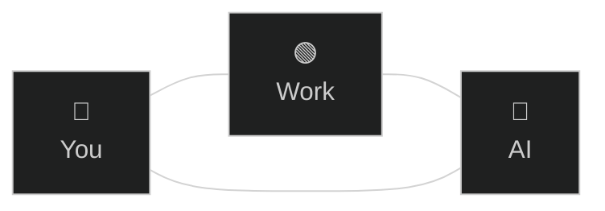

# Human agency
> AI is a lever that points where **you** point it.

There is you, the work, and now the AI.

That's three relations: you with the work, the AI with the work, and you with the AI. The arching goal is to augment all of it (all entities, all relations), in such a way that it's not just the work that ends in a better place, it's also **you**.

Evidently, this requires also bettering the AI as one angular piece of this system. We never forget that whether manually or through the AI, it's always *us* producing the work. There is no abdication of responsibility for using a new fancy tool; the hammer isn't to blame for nails badly nailed.

To be clear: you want your AI to be *cracked*, and there is no one else but you to *lift it up beyond its default baseline* for your specific tasks. You are the sole agency **over** the model in your sessions (including those you automate through code: you decide the inputs).

When we do it right, the AI *lifts the human up beyond its starting point*. The human-AI pair becomes more than the sum of its parts, a [dual entity](../praxis/dual-user.md) of sorts. That is the endgame of augmented human agency: AI, with its synthetic agency, works *with* us, not just *for* us.
