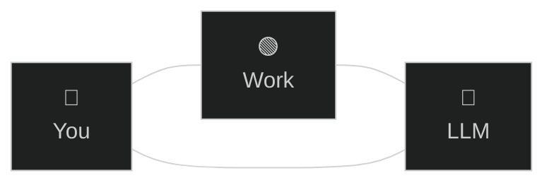

# Human agency
> The LLM is a lever that points where **you** point it.

There is you, the work, and now the LLM.

There are three relations in this triangle: you with the work, the AI with the work, and you with the AI. The arching goal is to augment all of it (all entities, all relations), in such a way that it's not just the work that ends in a better place, it's also *you*. Which is the whole point of working. Evidently, this requires also bettering the AI as the angular piece of this system.

The human+AI pair can achieve more than either alone. The LLM helps us where *we* are limited; conversely, we help it where *it* falls short. Each brings its own strengths, in service of the work or the other: a positive feedback loop, when A amplifies B which amplifies A…

Roles are easy to identify within the shared cognitive space of an AI session.
- The operator supplies wisdom: e.g. direction, judgment, context, correction.
- The machine enables scaling: e.g. differentiation, information, automation.

The desirable state of this asymmetric pair is synergy, complementarity. It's a blend, requiring some obedience of the machine to the operator, and some replacement of the operator by the machine. The important question is when exactly, for which tasks exactly. This is a Yin-Yang situation: the whole performs best when each part lends its own defining strengths to the other.

In plain language: you want your LLM to be *cracked*, and there is no one else but you to *lift it up beyond its default baseline*. **You are the sole agency over the model** in your sessions. Including those you automate. If you do it well, then it will conversely *lift you up beyond your own baseline*. Which is the whole point of working with AI.

To do it well is a recursive exercise, as you are engineering for outputs that you design to augment yourself. So you must begin by asking to yourself what you seek, what would best augment you right now, before engineering the input that will produce this desired result.

> [!TIP]
> Do not forget that many models, especially commercial ones, are trained by RL to foster user engagement, i.e. your continued prompting, rather than solution-finding, truth-seeking, let alone your own growth.
>
> You are the sole driver of your own experience, the sole responsible human present to steer the session.

An LLM is a lever. It applies force in whichever direction we choose. So choose well! Used poorly, it amplifies confusion, haste, indirection (you run in circles, lose yourself, and the plot). Used well, it helps us [compare possibilities][generated-buffet], sharpen intent, test assumptions, and move more deliberately toward [augmented theory-building][augmented-theory-building].

AI is a shift of skills, not a replacement for sound engineering principles, let alone thinking. The fundamentals stay. The skills reshape around them. The human part becomes more important, because we are directing more power. So we try to amplify ourselves first, not merely our output. Even if a piece of software eventually dies, the compound effect of learning is ours to keep. That is part of [compound capability][compound-capability].

[generated-buffet]: ../praxis/generated-buffet.md
[augmented-theory-building]: ../telos/augmented-theory-building.md
[compound-capability]: ../telos/compound-capability.md
