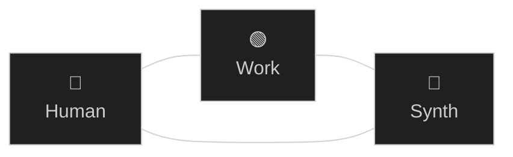

# Human agency
> The human bears concern.

There is the human, the [synth](/terms.md#synth), and the work.

```mermaid
graph LR
%%{init: {"theme": "dark"}}%%
Human["🔴<br>Human"]
Work["🟢<br>Work"]
Synth["🔵<br>Synth"]
Human --- Work --- Synth --- Human
```

The synth can operate on the work.  
The human can operate on the work.  
The human also operates the synth.

This triangle does not make the three parts equal.

The human has primacy because the human bears [concern](/terms.md#concern): stakes, values, taste, responsibility, consequence, and continuity through time. The work enters reality. Code runs or breaks. Users benefit or suffer. Money is spent. Trust is won or lost. That return does not land on the synth as a life. It lands on people.

A synth may expand human agency, but it does not replace its source. It can transform means. It can help compare, articulate, and test possible ends. It cannot become the authority over them.

Used poorly, a synth invites deferred agency: outsourced judgment, delegated skill, borrowed understanding. That does not merely risk worse work. It weakens the worker.

Used well, a synth compounds agency. The human sees more, compares better, tests faster, acts wider, and returns stronger.

This is what good tools have always done. They move the boundary of action without removing the operator. The good version does not make the human smaller. It makes the human more capable.

The point is better work by a better human.

[compound-capability]: ../telos/compound-capability.md
