# Dual User
> AI 🔄 human synergy

A human+AI pair can achieve more than either alone. 

## Synergy
> Complementarity of alien parts

We seek a self-reinforcing positive feedback loop, when A amplifies B which amplifies A… Each brings its own defining strengths, either in service of the work, or of each other.
- The AI helps us where *we* are limited.
- Conversely, we help it where *it* falls short.

We call this **synergy**, which forms a Yin-Yang or double-helix type of back-and-forth dynamics. In practice, it is cumulative and [compounds][compound-capability]., in the iterative journey of working through a problem.

```mermaid
---
title: AI-Operator Synergy
---
%%{init: {
  "theme": "dark",
  "themeVariables": {
    "edgeLabelBackground': '#000",
    "lineColor": "#000"
  }
}}%%
graph
subgraph bg[" "]
  direction TB
    subgraph OP["OP (Operator)"]
    o1(("baseline<br>❤️"))
    o2(("Level UP!<br>❤️❤️"))
    o3(("Level UP!<br>❤️❤️❤️"))
    end

    subgraph AI["AI (Machine)"]
    m0{{"baseline<br><code>…"}}
    m1{{"Level UP!<br>💙"}}
    m2{{"Level UP!<br>💙💙"}}
    m3[" "]
    end

    o1 om1@--> |"input 1"| m1
    o2 om2@--> |input 2| m2
    m1 mo1@-->|"output 1"| o2
    m2 mo2@-->|output 2| o3
    
    m0 --- m1
    m2 --- m3

end
    style OP fill:#000,stroke:#f336,stroke-width:1px,color:#f33;
    style AI fill:#000,stroke:#39f7,stroke-width:1px,color:#39f;
    style bg fill:#000

    style o1 fill:#000,stroke:#fff,color:#fff;
    style o2 fill:#000,stroke:#f99,color:#f99;
    style o3 fill:#000,stroke:#f00,color:#f00;

    style m0 fill:#000,stroke:#000,color:#fff;
    style m0 fill:#000,stroke:#fff,color:#fff;
    style m1 fill:#000,stroke:#9cf,color:#9cf;
    style m2 fill:#000,stroke:#39f,color:#39f;
    style m3 fill:#000,stroke:#000,color:#fff;

    linkStyle 0 color:#fff,stroke:#fff,stroke-width:3px;
    
    linkStyle 1 color:#f77,stroke:#f77,stroke-width:3px;

    linkStyle 2 color:#9cf,stroke:#9cf,stroke-width:3px;
    linkStyle 3 color:#39f,stroke:#39f,stroke-width:3px;
    
    linkStyle 4 stroke-width:0px;
    linkStyle 5 stroke-width:0px;


  classDef animate stroke-dasharray: 9,5,stroke-dashoffset: 900,animation: dash 25s linear infinite;
  
  class om1,mo1,om2,mo2 animate
  
```

## Separation
> In nature, and of concerns.

The role of each part is easy to identify in its core features, and there is overlap thanks to NLP (natural language processing). It's harder to differentiate at the interface between the two: you learn it with practice.

- The **human** brings preferences and moral decisions.  
    - E.g. goals, values, direction, real-world context, adjustment, evaluation and judgment.
    - As a physical and mortal being, humans know valid real-world consequences, architecture, feelings, …

- The **AI** handles raw information.
    - E.g. persistence, logic, pseudosemantics, for differentiation, arrangement, automation.
    - As a digital and virtual system, AI within its boundaries is stateless, indefatiguable, unburdened by difficulty or scale, …

It's a blend, where both meet in some common language (NLP or code). To function properly, requires some obedience of the AI to the human, and some replacement of the human by the AI. The important question is when, exactly, for which tasks.

## Augmentation

To do it well is a self-reflexive exercise, as you design outputs whose purpose is to augment yourself. So you must begin by asking to yourself what you seek, what would best augment you right now, before engineering the input that will produce this desired result.

> [!TIP]
> Do not forget that many models, especially commercial ones, are trained by RL to foster user engagement, i.e. your continued prompting, rather than solution-finding, truth-seeking, let alone your own growth.
>
> You are the sole driver of your own experience, the sole responsible human present to steer the session.

An LLM is a lever. It applies force in whichever direction we choose. So choose well! Used poorly, it amplifies confusion, haste, indirection (you run, but in circles, lose yourself, and the plot). Used well, it helps us [compare possibilities][generated-buffet], sharpen intent, test assumptions, and move more deliberately toward [augmented theory-building][augmented-theory-building].

AI is a shift of skills, not a replacement for sound engineering principles, let alone thinking. The fundamentals stay. The skills reshape around them. The human part becomes more important, because we are directing more power. So we try to amplify ourselves first, not merely our output. Even if a piece of software eventually dies, our learning [compounds][compound-capability].

[generated-buffet]: ../praxis/generated-buffet.md
[augmented-theory-building]: ../telos/augmented-theory-building.md
[compound-capability]: ../telos/compound-capability.md
