# Dual User
> Human 🔄 Model

A human-model pair, co-operating with synergy, can achieve more than either alone.  
Synergy requires clear separation first, so each part can augment each other.

## Synergy
> Complementarity of alien parts

The goal is a self-reinforcing positive feedback loop, where A amplifies B which amplifies A… Each bringing its own defining strengths, either in service of the work, or of the other.

We call this **synergy**. The dynamics are similar to a Yin-Yang or double-helix type of back-and-forth.

```mermaid
---
title: Human-Model Synergy
---
%%{init: {
  "theme": "dark",
  "themeVariables": {
    "edgeLabelBackground': '#000",
    "lineColor": "#000"
  }
}}%%
graph
subgraph bg[" "]
  direction TB
    subgraph OP["Human"]
    o1(("baseline<br>❤️"))
    o2(("Level UP!<br>❤️❤️"))
    o3(("Level UP!<br>❤️❤️❤️"))
    end

    subgraph model["Model"]
    m0{{"baseline<br><code>…"}}
    m1{{"Level UP!<br>💙"}}
    m2{{"Level UP!<br>💙💙"}}
    m3[" "]
    end

    o1 om1@--> |"input 1"| m1
    o2 om2@--> |input 2| m2
    m1 mo1@-->|"output 1"| o2
    m2 mo2@-->|output 2| o3
    
    m0 --- m1
    m2 --- m3

end
    style OP fill:#000,stroke:#f336,stroke-width:1px,color:#f33;
    style model fill:#000,stroke:#39f7,stroke-width:1px,color:#39f;
    style bg fill:#000

    style o1 fill:#000,stroke:#fff,color:#fff;
    style o2 fill:#000,stroke:#f99,color:#f99;
    style o3 fill:#000,stroke:#f00,color:#f00;

    style m0 fill:#000,stroke:#000,color:#fff;
    style m0 fill:#000,stroke:#fff,color:#fff;
    style m1 fill:#000,stroke:#9cf,color:#9cf;
    style m2 fill:#000,stroke:#39f,color:#39f;
    style m3 fill:#000,stroke:#000,color:#fff;

    linkStyle 0 color:#fff,stroke:#fff,stroke-width:3px;
    
    linkStyle 1 color:#f77,stroke:#f77,stroke-width:3px;

    linkStyle 2 color:#9cf,stroke:#9cf,stroke-width:3px;
    linkStyle 3 color:#39f,stroke:#39f,stroke-width:3px;
    
    linkStyle 4 stroke-width:0px;
    linkStyle 5 stroke-width:0px;


  classDef animate stroke-dasharray: 9,5,stroke-dashoffset: 900,animation: dash 25s linear infinite;
  
  class om1,mo1,om2,mo2 animate
  
```

## Separation
> In nature, and of concerns.

The role of each part is easy to identify in its core features, and there is overlap thanks to NLP (natural language processing). It's harder to differentiate at the interface between the two: you learn, with practice, what to do yourself and what to defer to the LLM. It's bad to generalize to broadly, but for the sake of orientation, here are exclusive qualities (by extension, lacking in the other).

- The **human** brings preferences and moral decisions.  
    - E.g. goals, values, direction, real-world context, adjustment, evaluation, judgment.
    - As a physical and mortal being, the human knows valid real-world consequences, architecture, feelings; it needs to survive (eat, sleep, …), to work (pay the bills, grow), to learn, and to love (people and things).

- The **model** handles raw information at scale.
    - E.g. persistence, logic, pseudosemantics, for differentiation, arrangement, automation.
    - As a digital and virtual system, the model operates orders of magnitude faster, on bigger targets, with much better precision; it is immortal, indefatiguable, packed with knowledge, and amotional.

It's a blend, where both meet in some common language (NLP or code). To function properly, requires some obedience of the model to the human, and some replacement of the human by the model. The important question is when, exactly, for which tasks.

## Augmentation

When separation is done right (to each their role), the model may augment human agency above its baseline, by contributing with super-human capabilities. Conversely, the human supplies super-machine capabilities, augmenting the model. The human-model pair becomes more than the sum of its parts, a [dual entity][dual-entity] of sorts. That is the endgame of augmented human agency: model, with its synthetic agency, works *with* us, not just *for* us.

To do it well is a self-reflexive exercise, as you design outputs whose purpose is to augment yourself. So you must begin by asking to yourself what you seek, what would best augment you right now, before engineering the input that will produce this desired result.

> [!TIP]
> Do not forget that many models, especially commercial ones, are trained by RL to foster user engagement, i.e. your continued prompting, rather than solution-finding, truth-seeking, let alone your own growth.
>
> You are the sole driver of your own experience, the sole responsible human present to steer the session.

An LLM is a lever. It applies force in whichever direction we choose. So choose well! Used poorly, it amplifies confusion, haste, indirection (you run, but in circles, lose yourself, and the plot). Used well, it helps us [compare possibilities][generated-buffet], sharpen intent, test assumptions, and move more deliberately toward [theory-building][augmented-theory-building].

model is a shift of skills, not a replacement for sound engineering principles, let alone thinking. Fundamentals stay. As humans, we are directing more power: so we try to better ourselves first, to aim better.

[generated-buffet]: ../praxis/generated-buffet.md
[augmented-theory-building]: ../telos/augmented-theory-building.md
[compound-capability]: ../telos/compound-capability.md
[dual-entity]: ../praxis/dual-user.md
